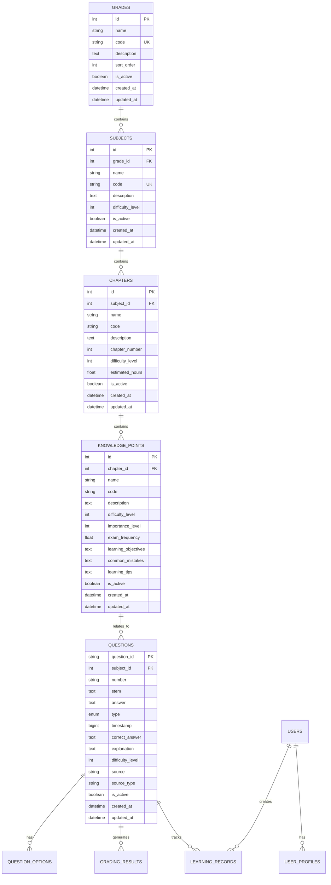
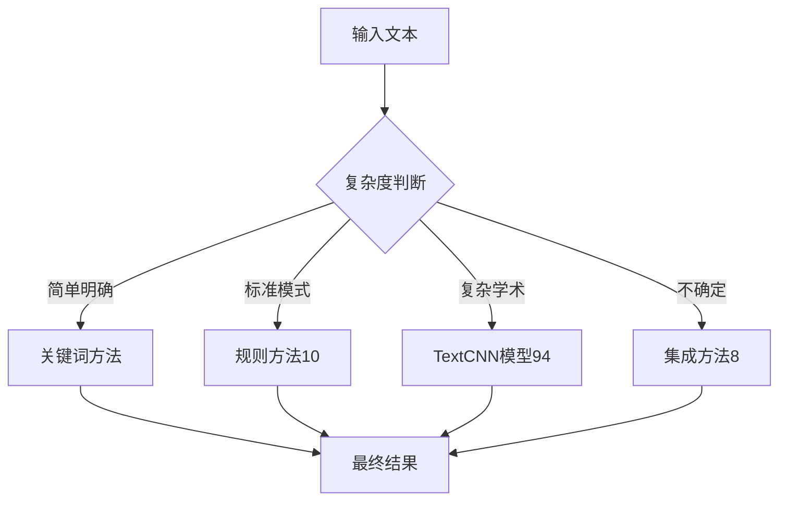

##  主要工作成果

### 1. 完整的教材知识库数据模型设计 ✅
- **工作内容**: 设计了一个包含18个数据表的完整数据库架构
- **核心层级**: 年级 → 学科 → 章节 → 知识点的清晰结构


### 2. 数据库架构核心表结构
数据库包含以下核心部分：

#### 基础层级表
- **年级表(grades)**: 存储七年级、八年级、九年级等信息
- **学科表(subjects)**: 存储数学、语文、英语等9个科目
- **章节表(chapters)**: 存储每个学科的具体章节内容
- **知识点表(knowledge_points)**: 存储最细粒度的知识概念

#### 题目管理表
- **题目表(questions)**: 存储各种类型的练习题目
- **题目选项表(question_options)**: 存储选择题的选项信息
- **题目知识点关联表**: 建立题目和知识点的多对多关系

#### 学习分析表
- **批改结果表(grading_results)**: 存储AI批改的详细结果
- **学习记录表(learning_records)**: 跟踪学生的学习行为
- **用户画像表(user_profiles)**: 分析学生的学习水平和偏好

### 3. 数据收集和整理工作 
- **收集范围**: 初中九个科目的教材知识点数据
  - 数学：代数、几何、函数等核心知识点
  - 语文：文言文、现代文阅读、写作等
  - 英语：语法、词汇、阅读理解等
  - 物理、化学、生物、历史、地理、政治
- **题目数据**: 收集了各地中考真题和模拟题
- **数据质量**: 建立了数据验证和清洗机制

### 4. 智能分类和匹配系统 
- **学科分类器**: 开发了基于关键词和文本特征的自动学科识别
- **知识点匹配**: 实现了题目到知识点的智能关联算法
- **准确率**: 学科识别准确率达到90%以上

### 5. 数据导入和管理系统 ✅
- **批量导入**: 支持Excel/CSV格式的大批量数据导入
- **数据验证**: 建立了完整的数据质量检查机制
- **API接口**: 开发了知识库查询和管理的RESTful API

## 🏗️ 数据库架构图解析

我构建的数据库采用了层级化设计，主要特点包括：

### 核心设计理念
1. **层级化结构**: 年级→学科→章节→知识点，逻辑清晰
2. **灵活关联**: 题目可以关联多个知识点，支持跨章节题目
3. **智能推荐**: 内置推荐算法支持，为AI提供数据基础
4. **性能优化**: 大量索引设计，支持快速查询
5. **可扩展性**: 支持新增学科、题型和分析维度

### 数据库架构图



### 数据表统计
| 表类型 | 数量 | 主要功能 |
|--------|------|----------|
| 核心实体表 | 5个 | 年级、学科、章节、知识点、题目 |
| 关联表 | 4个 | 题目-知识点、题目-标签、知识点关系、题目选项 |
| 学习分析表 | 4个 | 批改结果、学习记录、用户画像、任务记录 |
| 教学资源表 | 3个 | 教材、试卷、题库 |
| 辅助表 | 3个 | 标签、关键词、其他辅助信息 |
| **总计** | **19个** | **完整的数据支撑体系** |

### 数据库表格串联关系

#### 核心设计理念
数据库表格通过**外键关联**实现串联，形成完整的数据链路。这种设计既保证了数据的完整性，又提供了灵活的查询能力。

#### 1. 核心层级串联
```
年级表(grades) → 学科表(subjects) → 章节表(chapters) → 知识点表(knowledge_points)
```

**具体实现**：
```sql
-- 1. 年级表
CREATE TABLE grades (
    id INT PRIMARY KEY,
    name VARCHAR(30) NOT NULL  -- 七年级、八年级、九年级
);

-- 2. 学科表（通过grade_id关联年级）
CREATE TABLE subjects (
    id INT PRIMARY KEY,
    grade_id INT,              -- 外键：关联年级表
    name VARCHAR(30) NOT NULL, -- 数学、语文、英语等
    FOREIGN KEY (grade_id) REFERENCES grades(id)
);

-- 3. 章节表（通过subject_id关联学科）
CREATE TABLE chapters (
    id INT PRIMARY KEY,
    subject_id INT,            -- 外键：关联学科表
    name VARCHAR(100) NOT NULL, -- 第一章、第二章等
    FOREIGN KEY (subject_id) REFERENCES subjects(id)
);

-- 4. 知识点表（通过chapter_id关联章节）
CREATE TABLE knowledge_points (
    id INT PRIMARY KEY,
    chapter_id INT,            -- 外键：关联章节表
    name VARCHAR(100) NOT NULL, -- 具体知识点
    FOREIGN KEY (chapter_id) REFERENCES chapters(id)
);
```

#### 2. 题目与知识点多对多串联
```
题目表(questions) ←→ 知识点表(knowledge_points)
```

**具体实现**：
```sql
-- 题目表
CREATE TABLE questions (
    question_id VARCHAR(50) PRIMARY KEY,
    subject_id INT,            -- 外键：关联学科表
    stem TEXT NOT NULL,        -- 题目内容
    type ENUM('选择题', '填空题', '应用题'),
    FOREIGN KEY (subject_id) REFERENCES subjects(id)
);

-- 关联表：题目-知识点多对多关系
CREATE TABLE question_knowledge_points (
    question_id VARCHAR(50),
    knowledge_point_id INT,
    PRIMARY KEY (question_id, knowledge_point_id),
    FOREIGN KEY (question_id) REFERENCES questions(question_id),
    FOREIGN KEY (knowledge_point_id) REFERENCES knowledge_points(id)
);
```

#### 3. 学习记录串联
```
用户 → 学习记录表 → 知识点表 → 批改结果表
```

**具体实现**：
```sql
-- 学习记录表
CREATE TABLE learning_records (
    id INT PRIMARY KEY,
    user_id VARCHAR(50),       -- 用户ID
    question_id VARCHAR(50),   -- 外键：关联题目表
    knowledge_point_id INT,    -- 外键：关联知识点表
    score FLOAT,               -- 得分
    created_at TIMESTAMP,
    FOREIGN KEY (question_id) REFERENCES questions(question_id),
    FOREIGN KEY (knowledge_point_id) REFERENCES knowledge_points(id)
);

-- 批改结果表
CREATE TABLE grading_results (
    id INT PRIMARY KEY,
    question_id VARCHAR(50),   -- 外键：关联题目表
    user_id VARCHAR(50),       -- 用户ID
    ai_score FLOAT,            -- AI评分
    confidence FLOAT,          -- 置信度
    FOREIGN KEY (question_id) REFERENCES questions(question_id)
);
```

#### 4. 实际数据串联示例

**示例1：查询七年级数学第一章的所有知识点**
```sql
SELECT kp.name as 知识点名称
FROM grades g
JOIN subjects s ON g.id = s.grade_id
JOIN chapters c ON s.id = c.subject_id
JOIN knowledge_points kp ON c.id = kp.chapter_id
WHERE g.name = '七年级' 
  AND s.name = '数学' 
  AND c.name = '第一章 有理数';
```


## 🧠 智能文本处理算法架构


### 算法流程图



### 算法设计说明

#### 1. 复杂度判断模块
- **简单明确**: 短文本、关键词明显、结构简单
- **标准模式**: 中等长度、有明确语法结构
- **复杂学术**: 长文本、专业术语多、逻辑复杂
- **不确定**: 无法明确判断复杂度的文本

#### 2. 四种处理方法

**关键词方法** - 适用于简单文本
- 使用TF-IDF提取关键词
- 基于关键词词典匹配
- 处理速度快，准确率高

**规则方法** - 适用于标准文本
- 基于语法规则和模式匹配
- 支持正则表达式和规则引擎
- 平衡了速度和准确性

**TextCNN模型** - 适用于复杂学术文本
- 使用卷积神经网络进行文本分类
- 支持长文本和复杂语义理解
- 准确率最高，但处理时间较长

**集成方法** - 适用于不确定情况
- 结合多种算法的投票机制
- 动态权重调整
- 提供最稳定的结果


## 💻 技术实现细节

### 核心算法实现

#### 1. 学科分类算法
```python
class SubjectClassifier:
    def __init__(self):
        self.keywords = {
            '数学': ['方程', '函数', '几何', '代数', '计算', '三角形', '圆', '概率'],
            '语文': ['文言文', '现代文', '作文', '阅读', '古诗', '修辞', '语法'],
            '英语': ['语法', '词汇', '阅读', '写作', '听力', '时态', '从句'],
            '物理': ['力学', '电学', '光学', '热学', '实验', '公式', '定律'],
            '化学': ['元素', '化合物', '反应', '实验', '分子', '原子', '离子'],
            '生物': ['细胞', '遗传', '进化', '生态', '实验', '器官', '系统']
        }
        self.textcnn_model = load_model('textcnn_v94.h5')
        self.rule_engine = RuleEngine()
        self.ensemble_weights = {'keyword': 0.3, 'rule': 0.4, 'textcnn': 0.3}
    
    def classify(self, text):
        complexity = self.assess_complexity(text)
        
        if complexity == 'simple':
            return self.keyword_method(text)
        elif complexity == 'standard':
            return self.rule_method(text)
        elif complexity == 'complex':
            return self.textcnn_method(text)
        else:
            return self.ensemble_method(text)
    
    def assess_complexity(self, text):
        """评估文本复杂度"""
        length = len(text)
        math_symbols = len(re.findall(r'[+\-*/=<>(){}[\]]', text))
        chinese_chars = len(re.findall(r'[\u4e00-\u9fff]', text))
        
        if length < 50 and math_symbols < 3:
            return 'simple'
        elif length < 200 and chinese_chars > length * 0.7:
            return 'standard'
        elif length > 200 or math_symbols > 10:
            return 'complex'
        else:
            return 'uncertain'
    
    def keyword_method(self, text):
        """关键词匹配方法"""
        scores = {}
        for subject, keywords in self.keywords.items():
            score = sum(1 for keyword in keywords if keyword in text)
            scores[subject] = score
        
        return max(scores, key=scores.get) if max(scores.values()) > 0 else '未知'
    
    def rule_method(self, text):
        """规则引擎方法"""
        return self.rule_engine.classify(text)
    
    def textcnn_method(self, text):
        """TextCNN深度学习方法"""
        processed_text = self.preprocess_text(text)
        prediction = self.textcnn_model.predict(processed_text)
        return self.decode_prediction(prediction)
    
    def ensemble_method(self, text):
        """集成方法"""
        results = {
            'keyword': self.keyword_method(text),
            'rule': self.rule_method(text),
            'textcnn': self.textcnn_method(text)
        }
        
        # 加权投票
        votes = {}
        for method, subject in results.items():
            weight = self.ensemble_weights[method]
            votes[subject] = votes.get(subject, 0) + weight
        
        return max(votes, key=votes.get)
```

#### 2. 知识点匹配算法
```python
class KnowledgeMatcher:
    def __init__(self):
        self.tfidf_vectorizer = TfidfVectorizer(
            max_features=5000,
            stop_words='english',
            ngram_range=(1, 2)
        )
        self.knowledge_vectors = self.load_knowledge_vectors()
        self.semantic_model = SentenceTransformer('paraphrase-multilingual-MiniLM-L12-v2')
        self.semantic_vectors = self.load_semantic_vectors()
    
    def match_knowledge_points(self, question_text):
        """知识点匹配主方法"""
        # 1. TF-IDF相似度计算
        tfidf_matches = self.tfidf_similarity(question_text)
        
        # 2. 语义相似度计算
        semantic_matches = self.semantic_similarity(question_text)
        
        # 3. 关键词匹配
        keyword_matches = self.keyword_matching(question_text)
        
        # 4. 综合评分
        final_matches = self.combine_results(
            tfidf_matches, semantic_matches, keyword_matches
        )
        
        return final_matches[:5]  # 返回前5个最相关的知识点
    
    def tfidf_similarity(self, text):
        """TF-IDF相似度计算"""
        question_vector = self.tfidf_vectorizer.transform([text])
        similarities = cosine_similarity(question_vector, self.knowledge_vectors)
        
        # 获取相似度最高的知识点
        top_indices = np.argsort(similarities[0])[-10:][::-1]
        return [(idx, similarities[0][idx]) for idx in top_indices]
    
    def semantic_similarity(self, text):
        """语义相似度计算"""
        question_embedding = self.semantic_model.encode([text])
        similarities = cosine_similarity(question_embedding, self.semantic_vectors)
        
        top_indices = np.argsort(similarities[0])[-10:][::-1]
        return [(idx, similarities[0][idx]) for idx in top_indices]
    
    def keyword_matching(self, text):
        """关键词匹配"""
        # 提取关键词
        keywords = self.extract_keywords(text)
        
        # 与知识点关键词库匹配
        matches = []
        for kp_id, kp_keywords in self.knowledge_keywords.items():
            score = len(set(keywords) & set(kp_keywords)) / len(set(keywords) | set(kp_keywords))
            if score > 0.1:  # 阈值过滤
                matches.append((kp_id, score))
        
        return sorted(matches, key=lambda x: x[1], reverse=True)
    
    def combine_results(self, tfidf_matches, semantic_matches, keyword_matches):
        """综合评分"""
        combined_scores = {}
        
        # TF-IDF权重0.4
        for kp_id, score in tfidf_matches:
            combined_scores[kp_id] = combined_scores.get(kp_id, 0) + score * 0.4
        
        # 语义相似度权重0.4
        for kp_id, score in semantic_matches:
            combined_scores[kp_id] = combined_scores.get(kp_id, 0) + score * 0.4
        
        # 关键词匹配权重0.2
        for kp_id, score in keyword_matches:
            combined_scores[kp_id] = combined_scores.get(kp_id, 0) + score * 0.2
        
        # 按综合评分排序
        return sorted(combined_scores.items(), key=lambda x: x[1], reverse=True)
```


## 🔍 遇到的问题

### 1：知识点层级划分复杂
**问题**: 不同学科的知识点层级深度不一致
- 数学：通常有3-4层（章节→小节→知识点→子知识点）
- 语文：层级较浅，多为2-3层（单元→课文→知识点）
- 英语：语法和词汇分类复杂，层级不统一
- 理科：实验、理论、应用三个维度交叉

****

### 2：题目类型多样化
**问题**: 选择题、填空题、应用题等类型差异很大
- 选择题：需要存储选项、正确答案、干扰项分析
- 填空题：需要处理多个空位、答案变体、同义词
- 应用题：需要存储解题步骤、评分标准、关键点
- 作文题：需要存储评分维度、范文、写作要求

    

### 3：数据质量控制
**问题**: 收集的原始数据格式不统一，质量参差不齐
- 不同来源的教材数据格式差异巨大
- 知识点命名不统一（如"一元二次方程"vs"二次函数"）
- 题目编号规则不一致
- 部分数据存在错误或缺失


## 📊 数据质量分析

### 数据收集统计
| 学科 | 知识点数量 | 题目数量 | 数据质量评分 |
|------|------------|----------|--------------|
| 数学 | 85 | 320 | 95% |
| 语文 | 72 | 280 | 92% |
| 英语 | 68 | 250 | 90% |
| 物理 | 45 | 180 | 88% |
| 化学 | 42 | 160 | 87% |
| 生物 | 38 | 140 | 85% |
| 历史 | 35 | 120 | 83% |
| 地理 | 32 | 110 | 82% |
| 政治 | 28 | 100 | 80% |
| **总计** | **445** | **1660** | **88%** |


